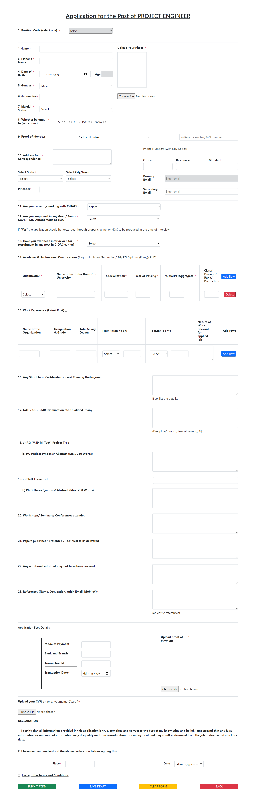

# FORM UI

---

### Task

- Instructions were to make exact same form UI with the help of Bootstrap and HTML.

---

### Learning

- It was a good experience to have an overall HTML revisison as form contain too many html tags e.g. select,table, input(file,date,datelocal),textarea etc.

---

### Screen Shot

---

### Time taken

- Time taken to make whole form in one go is 7 hours

---

### Live Link

- [Form UI](https://basic-form-ui.netlify.app/)
